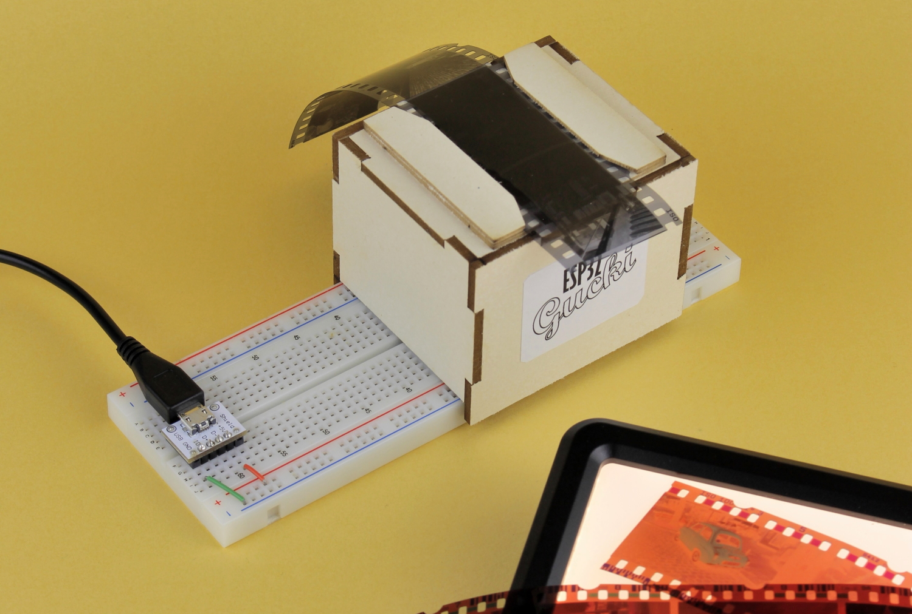

Maker Media GmbH

***

# ESP32-Gucki

## zeigt analoge Filmnegative positiv an

**Ist der Berghang auf dem Foto tief verschneit oder grob überbelichtet? Wer steht da neben der Tante, lacht der freundlich oder schaut er grimmig? Auf den Kleinbildnegativen vergangener Zeiten ist das nur schwer zu erkennen. Doch verbannen Sie dieses Problem dahin, wohin es gehört – ins vorige Jahrhundert. Denn heute zeigt nach kurzer Bastelarbeit unser ESP32-Gucki die Schnappschüsse von damals mit korrekten statt umgekehrten Tonwerten und Farben an – und so groß, wie es die Displays hergeben.**

Hier gibt es den Code für den Gucki sowie im Verzeichnis _CAD_ die **[Schneidevorlagen](./CAD/)** für die Bühne zum Download. Die komplette Bauanleitung steht im vollständigen Artikel zum Projekt in der **[Make-Ausgabe 5/22 ab Seite 22]([https://www.heise.de/select/make/2022/4/2215011001391248101](https://www.heise.de/select/make/2022/5/2204516083410475058))**.

## Zuschnitttipps

* Schauen Sie bei laufendem Sketch so in die Kamera auf dem Board, dass Sie die Beschriftung ESP32-CAM auf der Platine lesen können. Sehen Sie dann im Browser sich selbst in einer Querformat-Aufnahme, mit dem Kopf nach oben? Dann brauchen Sie die **Querformat-Schneidevorlage**. Denn wie sich bei der Arbeit für diesen Artikel herausstellte, gibt es auch (vermutliche ältere) ESP32-CAMs, bei denen der Sensor im Kameramodul um 90 Grad gedreht eingebaut ist. Ragt Ihr Konterfei im Browser also von der Schmalseite rechts oder links ins Bild hinein, ist die **Hochformat-Schneidevorlage** später richtig für Sie. 
* Wenn Sie wie im Artikel beschrieben 3mm starkes Material verwenden, können Sie die Teile direkt nach der Vorlage mit **3mm** im Dateinamen zuschneiden (**QF** steht für Querformat, **HS** für Hochformat). Wer einen Lasercutter benutzt, kann zuvor die Ebenen _Hilfslinien_ und ggf. auch die für die _Schrift_ in der SVG-Datei deaktivieren.
* Wenn Ihre Pappe nur 1,5mm oder 2mm dick ist, können Sie dennoch die 3mm-Vorlagen nutzen. Schneiden Sie dann aber die oberen Kerben von Front, Rückwand und den Seitenteilen nur so tief ein, wie Ihre Pappe dick ist (in den Vorlagen ist diese etwa für 1,5mm starke Pappe mit den grünen Linien angedeutet). Auf diese Weise liegt später die Oberseite des Deckels nach wie vor auf der korrekten Höhe von 50mm über dem Breadboard. Perfektionisten können nach dem Verkleben die an vielen Stellen hervorstehenden Laschen dann noch bündig abschneiden.  
* Haben Sie nur deutlich dünnere Pappe, nehmen Sie die QF- oder HF-Vorlage mit **Dünn** im Dateinamen. An den durchgezogenen Linien schneiden, die gestrichelten mit einem Messerrücken o.Ä. am Lineal entlang rillen, dann falten. Mit den Laschen zusammenkleben.
* Für die beiden Schienen nehmen Sie auf jeden Fall die Vorlage mit **1mm** im Dateinamen. Ist Ihre Pappe dafür deutlich dünner als 1mm, bitte von den beiden schmalsten Streifen zusätzliche Exemplare schneiden und so viele davon aufeinander geschichtet zusammenkleben, bis ihre Stärke 1mm erreicht, sonst klemmt das Negativ beim Verschieben möglicherweise.
* Die gelben Rechtecke auf den _Hilfslinien_-Ebenen zeigen, wo die beiden Schienen aufgeklebt werden müssen.

## Installationsanleitung

Die **[ausführliche Installationsanleitung](https://heise.de/-7263954)** gibt es auf der Webseite make-magazin.de.
